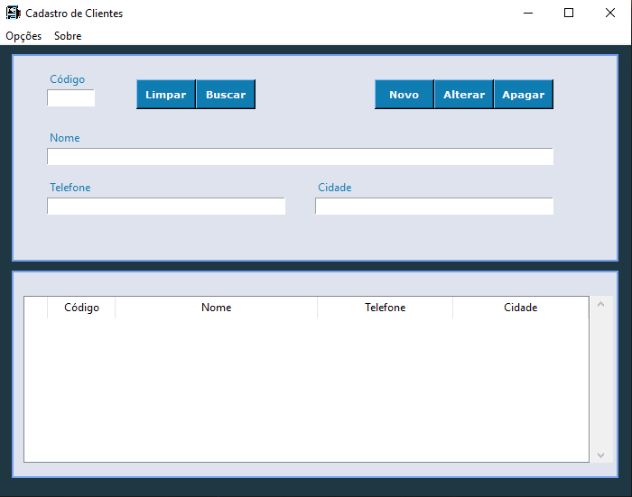

## Cadastro Clientes

Nesse pequeno projeto, estarei criando um pequeno programa de cadastro de Clientes. Utilizando a linguagem python e sua biblioteca TKINTER para criar uma pequena interface grafica, para que o usuario final tenha uma experiencia tranquila e sem estresse.
O banco de dados usado foi o SQLite para guardar os dados fornecidos.

TECNOLOGIAS USADAS:

- PYTHON
- TKINTER
- SQLite

## Funcionalidades do programa

O projeto consiste em um pequeno Crud basico para treinar a logica, mas muito funcional e util no dia a dia de um desenvolvedor de sistemas.

✅ Criar ou cadastrar: Adiconar codigo, nome, telefone e cidade. Campos podem ser limpos com um botao.

🔍 Leitura e busca: Busca por todos os indices e limpeza de campos caso necessario.

🔃 Atualizar: Podendo atualizar todas as informações de um cliente atraves de apenas um botao de atualizar.

❌ Apagar: Pode se apagar qualquer cliente do banco apenas com um click de um botao.

## interface 

